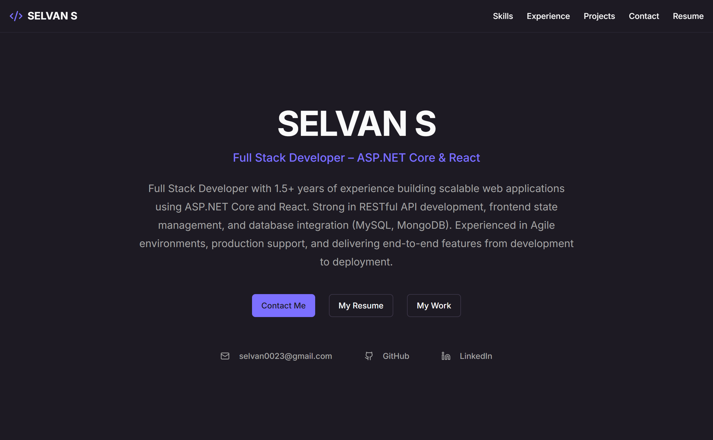

# Personal Portfolio

[Live Website](https://selvans.netlify.app)

## 📷 Preview

[](https://selvans.netlify.app)

This is a personal portfolio website built with Next.js, React, and Tailwind CSS. It's designed to showcase my skills, professional experience, and personal projects in a clean and modern interface.

## 🚀 Features

- **Responsive Design**  
  The website is fully responsive and adapts to different screen sizes including desktop, tablet, and mobile devices.

- **Project Showcase**  
  Displays selected projects with descriptions, technology stacks, and links to GitHub repositories and live demos.

- **Skills & Technology Section**  
  Highlights the programming languages, frameworks, and tools I work with.

- **Experience Timeline**  
  Presents my professional experience and development journey in a structured timeline format.

- **Contact Form Integration**  
  Includes a functional contact form powered by Resend for sending messages directly from the website.

- **Optimized Performance**  
  Built with Next.js to take advantage of modern performance optimizations such as static generation and fast page loading.

- **Modern UI Components**  
  Uses ShadCN UI components and Tailwind CSS for a clean, consistent, and modern interface.

- **Developer-Friendly Codebase**  
  Organized folder structure and TypeScript support for maintainability and scalability.

## 🛠️ Tech Stack

- **Framework**: [Next.js](https://nextjs.org/)
- **UI**: [React](https://react.dev/), [TypeScript](https://www.typescriptlang.org/)
- **Styling**: [Tailwind CSS](https://tailwindcss.com/)
- **UI Components**: [ShadCN UI](https://ui.shadcn.com/)
- **Form Handling**: [React Hook Form](https://react-hook-form.com/)
- **Email**: [Resend](https://resend.com/)
- **Icons**: [Lucide React](https://lucide.dev/guide/packages/lucide-react)

## 📦 Getting Started

Follow these instructions to set up the project locally.

### Prerequisites

- Node.js (v18.x or higher)
- npm

### Installation & Setup

1.  **Clone the repository.**

2.  **Install dependencies:**
    ```bash
    npm install
    ```

3.  **Set up environment variables:**
    Create a `.env` file in the root of the project and add your Resend API key. You can get a free key from [resend.com](https://resend.com).

    ```env
    RESEND_API_KEY=YOUR_API_KEY_HERE
    ```

4.  **Run the development server:**
    ```bash
    npm run dev
    ```
    The application will be available at `http://localhost:9002`.

## Deployment

This project is configured for deployment on Netlify. The `netlify.toml` file in the root directory contains the necessary build settings. Simply connect your Git repository to Netlify for automatic deployments.

## ✒️ Author

- **Selvan S**
- **GitHub**: [@Selvan-S](https://github.com/Selvan-S)
- **LinkedIn**: [selvan23](https://www.linkedin.com/in/selvan23/)

## 📄 License

This project is licensed under the MIT License.
